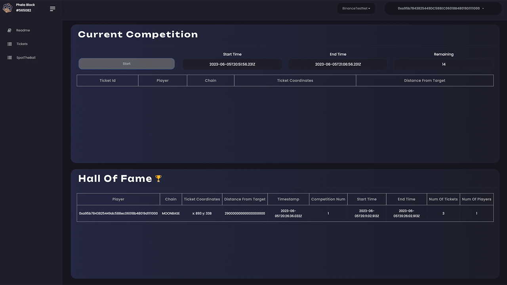
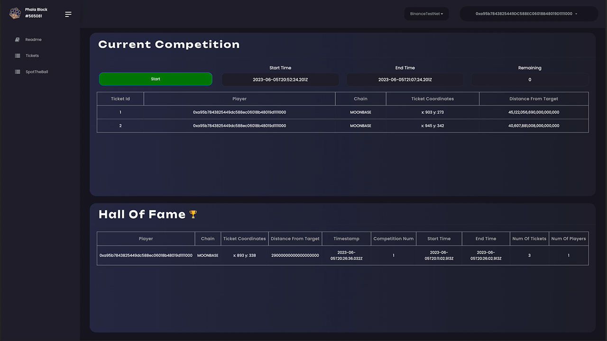

# Web3athon 2023 Hackathon

## Moonbeam Challenge -

## Use Moonbeam and a GMP Protocol to call a contract on a remote chain

 
<i>
To showcase the project, the following chains and protocols were included in the project:  

</i>

 

## Table of Contents

1. [General Info](#general-info)
2. [Chains Used](#chains-used)
3. [Visual Game Walkthrough](#visual-game-walkthrough)
4. [Detailed Walkthrough](#detailed-walkthrough)
5. [Repos](#repos)
6. [Installation](#installation)
7. [Phat Contract](#phat-contract)
8. [Appendix](#appendix)

 

## General Info

The Polkadot ecosystem is comprised of a relay chain, which provides the shared security of the network, and parachains that use Substrate unique strengths to offer custom based logic chains such as Privacy, Defi, NFTs, etc.

The horizontal parachain interconnectiviy that XCM brings to Polkadot is further enhanced with interconnectivity between other Ecosystems external to Polkadot (e.g. Binance Smart Chain) via the Moonbeam parachain and the use of General Messaging Protocols (GMP) e.g. Axelar Network.

In our submission we will show a portion of the above in a natural business logic flow.

For our use case we have built a version of the classic Web2 game called Spot The Ball.

Each game has a fixed time duration and shows an image (with an image hash) from a popular sport where the ball has been digitally removed.

The game players try to guess the position of the ball by using their observational skills regarding the position of the sportsmans eyes and body.

Each player can play as many times as he/she wants by submitting 1 or mutiple tickets at a time.

Each ticket carries the X,Y co-ordinates (player's estimation) and has a fixed price of 1 axlUSDC (Axelar USD) but payment is accepted also in INTR and ASTR for players that keep a balance on those repsective parachains.

Therefore, a game player can pay for a ticket by sending either:

- axlUSD directly when using either a wallet on Binance Smart Chain or Moonbeam
- The native asset of INTR on the Interlay chain
- The native asset of ASTR on the Astar chain

When playing the game with INTR or ASTR, the native asset amount of the ticket price (1 axlUSDC) will be calculated, transferred via XCM from the Interlay or Astar parachain to Moonbeam and then swapped for axlUSDC before finally deposited to the Game Prize Pot.

To avoid cheating, the traditional game of spot the ball doesnt actually use the position of the removed ball as the winning co-ordinates. In many cases it would be too easy for someone to find the original image somewhere. Therefore, in some cases a panel of judges are used to decide together where the winning position should be and then the ticket entries are all compared to that position to find a winner.

We obviously do not want to include the centralised nature of this approach and have therefore incorporated the answer to be decided by a "wisdom of the crowd" approach.

The winning solution of the game is calculated by finding the average of all tickets played in a single game.

The winner of the game is the player whose coordinates have the shortest distance from the wisdom of the crowd solution.

The game is comprised of Phat Ink! and Solidity EVM Smart Contracts deployed in Phala, Moonbeam & Binance Smart Chain.

 

## Chains Used

 

**_Phala_** is a parachain that among other things offers privacy and advanced off-chain decentralised computational abilities. Therefore we have created a Phat contract that provides:

- Privacy for each ticket played
- Calculation of the wisdom of the crowd solution
- Calculations on the distances of all ticket co-ordinates played to the WOTC solution to find the winning entry
- Sorted entries to allow the competition to offer multiple prizes in the future for close entries etc

 

**_Moonbeam_** is a parachain that offers a fully compatible EVM environment with a long list of precompiles that offer added functionality. For our case we are using the Xtokens Precompile for transferring the prize funds if the winning entry resides on the Astar or Interlay Parachains.

 

**_Astar_** is the biggest blockchain in Japan and offers an EVM enivironement and an Ink! smart contract environment. It also incorporates multiple blockchain bridges.

 

**_Interlay_** is the de-facto decentralised point of entry in Polkadot for the biggest crypto asset, BTC.

 

**_Binance Smart Chain_** is within the top 3 biggest blockchains with advanced protocols and a large audience.

 

**_Axelar_** delivers cross-chain communication for Web3 allowing Interchain dApps to be developed. It is possible to call a function in another ecosystem, wait for a callback and even transfer tokens with such instructions

 

## Visual Game Walkthrough

In the Tickets page we can see the Start button which is either green (meaning a new game can be started) or greyed out (if there is already an active game).

A new game can only start after the completion of any active game.

The start and end times in the upper part of the screen show when the game started and when it will be completed.

Finally the remaining amount of minutes in the game is also shown.

 

 

Once a new game has started, on the Spot The Ball page a fresh image is loaded within which the ball has been digitally removed.

Each game participant can click on the image and create a ticket with the generated coordinates.

Each ticket has a cost of 1 axlUSD (0.0001 DEV for testnet) and the user can play one or multiple tickets per time.

Each time the user clicks on the image they should then click the "play" button to generate a ticket with these selected coordinates.

When they are ready they can click "submit" to submit their tickets. The total cost in axlUSD is shown next to the submit button.

 

 

The Pot Size shows the total axlUSD (or DEV tokens in testnet) that have been deposited for the current game across all ecosystems (Moonbeam and Binance).

We can also see the Pots for each ecosystem (Moonbeam and Binance)
It is emportant to emphasize that the funds are gathered locally in each ecosystem e.g. Binance or Moonbeam as the native player to the ecosystem play the game. The interconnectivity of the 2 ecosystems via Axelar Network ensures that both ecosystems are in sync.

Therefore instead of transfering funds between the ecosystems to a smart contract residing in one of the ecoystems each time a ticket is played, funds are accumulated in each ecosystem (Moonbeam and Binance) and only transferred to the ecosystem where the winner resides.

Originall we considered fees of 20% of the Pot but for the hackathon submission we imposed no commisions.

Back on the Tickets Page, when the game expires the number of tickets played in the current game is shown underneath the Start button.

The winner of the game along with previous winners are shown. The bottom of the screen shows previous winners in a "Hall of Fame" with all their relevant details e.g. owner of the ticket winning coordinates, his wallet chain, competition id, number of players (account addresses), number of tickets and the Prize Money won.

 

 

When the competition completes on the SpotTheBall page we can see the solution: "Wisdom of the Crowd Answer" and the winning ticket coordinates.

The wisdom of the crowd dictates that the more tickets played, the closer the average prediction of the coordinates is to the real position of the ball.

Therefore the winning ticket is the one with the smallest distance to the Wisdom of the Crowd Answer.

 

 

Other Screenshots

 

 

 

## Detailed Walkthrough

Three solidity smart contracts are deployed on Moonbeam which are the acting headquarters of the game financials and three almost identical solidity smart contract are deployed in Binance Smart Chain as well.

These smart contracts are called AxelarGameManager.sol, GameDeposits.sol and GamePlayers.sol

- A player residing in Binance Smart Chain deposits 1 axlUSDC per ticket in the GameDeposits.sol smart contract which is then forwarded to the Binance residing AxelarGameMananger.
- A player residing in Interlay or Astar, has the equivalent of 1 axlUSDC in INTR or ASTR being transferred from Interlay or Axelar to the Moonbeam based GameDeposits.sol which as soon as it arrives is swapped for axlUSDC.
- A player in Moonbeam pays 1 axlUSDC per ticket by depositing into the Moonbeam based GameDeposits.sol and together with any previous INTR or ASTR (swapped to axlUSDC) are transferred to the Moonbean based AxelarGameManager.

> Note: When a player submits a ticket and pays the equivalent of 1 axlUSC whether after an INTR or ASTR swap or natively axlUSDC his details are registered in the GamePlayers.sol
> The players EVM address and if applicable Substrate address is recorded in the Moonbeam based GamePlayers.sol
> These details will be used in the final phase of the game to tranfer all winning to the winner's native wallet e.g. transfer winnngs in ASTR to winner Astar Substrate address, or if the winner is Moonbeam based, to his Moonbeam EVM account

At this point the finances of the Game are held in 2 different AxelarGameManager smart contracts deployed in Moonbeam and Binance Smart Chain.

All Axelar GMP messages between the 2 AxelarGameManagers at this point are about:

1. Registering a new game that is is now ready for the player's tickets.
2. Unregistering an existing game to state that the game has now expired and cannot acccept new deposits.

Following the Phat contract calculations that result in establishing the winner of the game our game moves to its next phase.

Axelar GMP messages spread the word about the winner's address and their ecosystem (Moonbeam or Binance) side in the AxelarGameManager smart contracts

In the Moonbeam AxelarGameManager headquarters a record of the winner's address is kept as it is read by all satellite AxelarGameManager contracts (in our case here Binance Smart Chain Satelite AxelarGameManager smart contract).

Now that all parties (AxelarGameManager smart contract) in both Moonbeam and Binance are in sync regarding the winning address and which ecosystem it resides on.

We are now ready for the final phase of the Game.

In the final phase if the winner's address:

- Resides on the Binance Smart chain then an Axelar GMP message transferring all axlUSD balance of the Game in Moonbeam is tranferred to the Binance Smart chain address.

- Resides on the Moonbeam chain then the reverse occurs, i.e. Any axlUSDC balace held for the game in the AxelarGameManager in Binance Smart Chain is transferred over Axelar GMP messages to the Moonbeam based AxelarGameManager.

The last thing remaining is the final payment of the prize pool to the winner.

- In the case that the winners address is on Binance Smart Chain all axlUSDC balance from the Binance based AxelarGameManager is trasferred to the GamePlayers.sol and from there to the winner's address.

- In the case that the winners address is on Moonbeam natively then a identical route is followed.

- In the case that the winners address is from Astar or Interlay then there is an added step where axlUSDC winnings transferred from Moonbeam based AxelarGameManager to the Moonbeam based GamePlayers.sol are **_swapped for ASTR or INTR tokens_** and then transferred natively (via XCM) to Astar and Interlay respectively.

> NOTE: In the Abis>Mainnet>Moonbeam we can find the files relevant for all StellaSwap interactions and also myXCM.sol for XCM transfers

At this point the game ends and the winner enjoys his winnings in their origin wallet on Moonbeam, Binance, Astar or Interlay.

> Note:
> Several game automations such as the expiry of a game, Axelar GMP messages and Axelar GMP token transfers require the use of an environment based EVM account pre-financed to support the above automations.
> For the purpose of the hackathon we are financing these accounts with a small balance to showcase our submission.
> In terms of business logic, such cost can be recouped from the game winnings commision retained for supporting the game.

 

## Repos

Phat contracts repo

https://github.com/Entity54/STB-Web3athon-Phat

 

Front End repo

https://github.com/Entity54/SpotTheBall-Web3athon

 

### Installation

The Phat contracts were written in the ink! Version 4. In the Phat contract repo the user can either build these from scratch using:

    $cargo contract build

or can find the ABI(metadata) phala_games_STB.json and the phala_games_STB.contract in the Phat_contracts folder here

For the front end, the user can:

    $yarn
    $npm start

and can see in http://localhost:3000/ the front end application connected to this Phat contract

---

 

## Phat Contract

By clicking the Start button in the front end in essence we call config_game function passing the imagehash (to be loaded from 4everland in next relase), the start and end time of the game, the ticket cost and fees percentage. The default ticket cost is 1 axlUSD and the default fees percentage is 20 for 20%
The finance aspects of the Phat contract will be removed as all finances will be hanlded in Moonbeam and the Satelite Axelar Network deployed smart contracts as shown in this submission

Soon after the check_game function is called every 2 blocks in the front end

> Note: Please be aware that sometimes on the testnet, the block interval can be as high as 2mins, so please be patient to wait a few blocks after transaction submission. After a couple of blocks the transactions are mined and the front end updates.

The check_game function is responsible for:

1. Starting the game if the block timestmap is greater than the game start time. It also resets certain storage variables to default so that the game can be played repeatedly.

2. Ending the game when the block timestamp has surpassed the end time for the game. It first turns the state of the game to false and then calls calculate_distances, find \_winners, set the winner halloffame struct and add it to the hall_of_fame_vec and finally transfer the Pot axlUSD funds to the winner (80% of the Pot) and the game owner (20% of the Pot after ensuring there is enough existential deposit for the phat contract).

The get_game_stat can be called at any time to see the game specifications.

The get_players shows us the unique account address that have played the game.

The get_players_mapping map a game particpant account address to the vector of all tickets he has played.

The get_all_tickets retireves all the ticket coordiantes played and the get_ordered_ticket_ids retrieves the unique ticket ids.

> Note: Bearing in mind the above a lot of analytic dash boards can be created to show the most frequest and biggest players for possibly allocating motivational rewards in futures games.

The get_sums query retrieves the running sum for x and y coordinates that is calcualted everytime a new ticket is played.

 

 

calculate_wisdom_of_crowd_coordinates calculates the average of x and y coordiantes of all tickets and it is viewable by calling get_wisdom_of_crowd_coordinates.

submit_tickets is used to submit one or more ticket coordinates. It ensures that the required amount of axlUSD has also been paid and it updates the total_pot, total_net_pot and total_fees.

calculate_distances uses the Pythagorean Square theorem to calculate the distance of every played ticket from the Wisdom of The Crowd (x,y) coordinates. Finally it sorts the tickets based on the minimum distance and stores the relevant ticket ids in ordered_ticket_ids.

> Note: The amount of computation makes Phat contracts the perfect medium to operate the game.

Now the find_winners can be called.

> Note: in the current version we are using the case of a single winnner, but this function shows how easy it is to switch to a game version with multiple winners and variable winning prizes.

get_winning_tickets allows us to view the winning tickets.

The make_payments functions is called privately from the check_game to make the payments to the winning account address and the administrator address (owner of the game).

Finally the get_hall_of_fame query allows us to retreive the vector with all hall of fame structs. Now we have a list of all past winners.

> Note: By having the list of past winners, in a future version we could allocate NFTs enabling exclusive game competions with much higher prizes for previous winners holding the NFTs.

 
 

## APPENDIX

## Addresses of deployed contracts

 

# TESTNET

### Moonbase Alpha Testnet

axelar_game_manager_moonbase_address = "0x264D7022404bD7AE3ca3CE817347DC1cDD036368";

game_players_moonbase_address = "0xe34dc382EAf965fDbBEFC267c59ed399fBCD1Dd6";

game_deposits_moonbase_address = "0x20a9C9dAFef8D9BDaC2de110FD13443fB5679913";
 

### Binance Testnet

axelar_game_manager_binanceTestNet_address = "0xe295348aC14AdC064273d71A21f6520b2B634884";
game_players_binanceTestNet_address = "0x78ae32d083606fdf12630A9f8A20bF0FEDcbcFdD";
game_deposits_binanceTestNet_address = "0xA7ceeB7D789f68d197A3181156B69372c8eE6a5F";
 

### Phala Closed-Beta Testnet

phat_games_STB_contractId = "0xe1302a8db9ead738c2de1f483a6c01d4b4e3595ca271aa291cc7ecdbbd2b42ab"

CODE HASH 0x6f6dc3a36a2dc00c2fa56f9b6f8f6814e7d92403e1909d98058909fdb4b57215

LANGUAGE ink! 4.2.0

COMPILER rustc 1.68.2

DEVELOPER 464inykovjdRPhMhW2zbJ47iA8qYSmPWqKLkaEgH2xc6SQ4c

CLUSTERID 0x0000000000000000000000000000000000000000000000000000000000000001

STAKES 0.01

 
 

# MAINNET

StellaSwap = 0x24aA375Ba88cC6751c2998fA24B007C48d0bA6a4

myXCM = 0xc440b4621b985d441DaA33b2d11C951Bc344C98e

Moonbeam

AxelarGameManager.sol. 0xEa88A112F8D6028BE88E5766581081E9F05A8b7f

GamePlayers.sol. 0xdcb5b9b361CA6c24C383158c825D9bf4C75b1b60

GameDeposits.sol. 0xEdf6321Df783dB1cC2f145791E06cC7546F715e7

Binance

AxelarGameManager.sol 0x70bEdA6E7dA0B08A0529b50F4A5d3a3c0D98EBa5

GamePlayers.sol 0x6B4f4DBB62A98A8635Cb070E128D9f01C0aECebd

GameDeposits.sol 0xB17F49d8f51AF38a16fF3D7e7e8199da995336e2
